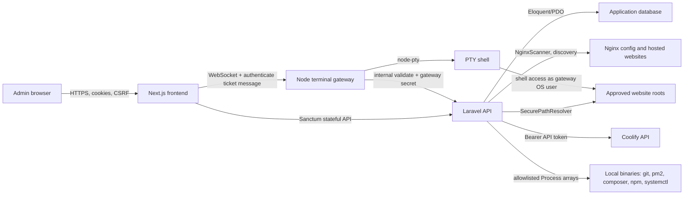

# YouPanel Security Architecture Review

Review date: 2026-08-08

Scope: read-only audit of the current YouPanel repository at `C:\Users\youssef\Desktop\projects\controlpanel`. This report was prepared from source inspection, local dependency advisory checks, and redacted pattern scanning. It does not include live production host inspection, live network probing, credential validation, or deployment validation.

Important handling note: no secret values are copied into this document. Any sensitive example is redacted as `[REDACTED]`. Where production state cannot be verified from the repository alone, this report says `Not verified.`

## 1. Executive Summary

YouPanel is a production-oriented self-hosted server management panel with a Laravel API, a Next.js frontend, local discovery of Nginx-hosted websites, file workspace operations, a database workbench, Coolify deployment integration, allowlisted server actions, and a browser-accessible terminal gateway.

The strongest design choices found in the repository are:

- First-party session authentication with Laravel Sanctum, CSRF protection, stateful API middleware, and constrained CORS origins (`backend/bootstrap/app.php:54`, `backend/config/sanctum.php:21`, `backend/config/cors.php:19`).
- Clear owner/developer/editor/viewer role model, with owner-only gates around global/local-server operations such as discovery, terminal sessions, database workbench, and file-root configuration (`backend/app/Enums/UserRole.php:7`, `backend/app/Models/User.php:51`, `backend/app/Http/Controllers/Api/V1/WebsiteDiscoveryController.php:16`).
- Explicit rate limiters for authentication, file operations, sensitive operations, deployments, logs, Coolify, and console commands (`backend/app/Providers/AppServiceProvider.php:49`).
- A file workspace resolver that normalizes relative paths, blocks traversal, checks real paths, detects symlink escapes, and treats `.env`, keys, credentials, and secret-like files as protected (`backend/app/Services/SecurePathResolver.php:18`, `backend/app/Services/SecurePathResolver.php:77`, `backend/app/Services/SecurePathResolver.php:181`).
- Server command execution is primarily allowlist-based and uses Symfony `Process` arrays instead of shell strings (`backend/app/Services/Operations/ProcessActionExecutor.php:20`, `backend/app/Services/Console/RestrictedConsoleService.php:142`).
- CSP, frame blocking, nosniff, referrer policy, permissions policy, and HSTS-on-HTTPS are set by the frontend proxy (`frontend/proxy.ts:54`, `frontend/proxy.ts:91`).

The main residual risks after the hardening implementation are:

- MEDIUM: the browser terminal remains intentionally powerful shell access for owners when explicitly enabled. The protocol now uses one-time tickets outside the URL, atomic consume, strict gateway validation, sanitized PTY environment, and lifecycle audit events, but production safety still depends on running the gateway as a dedicated non-root OS user (`backend/app/Services/Terminal/TerminalSessionService.php`, `backend/terminal-gateway/server.mjs`).
- MEDIUM: database workbench safety now defaults disabled, requires explicit `YOUPANEL_DATABASE_ADMIN_*` credentials, includes readonly mode, SQL hardening, size limits, and grant diagnostics, but MySQL privileges remain the final boundary (`backend/config/youpanel.php`, `backend/app/Services/Databases/MySqlDatabaseDriver.php`, `backend/app/Services/Databases/SqlStatementClassifier.php`).
- LOW: passkeys/WebAuthn are not implemented yet. TOTP remains supported and encrypted/hashed fields are preserved.
- LOW: OS-level production isolation, reverse-proxy behavior, and real database grants are deployment facts and remain Not verified from the repository alone.

Overall repository security score after implementation: 8.9 / 10. This reflects code-backed improvements, not a guarantee of production host posture.

## 2. Repository Structure

Top-level structure observed:

- `backend/`: Laravel 12 API, models, policies, controllers, service classes, migrations, tests, terminal gateway, config.
- `frontend/`: Next.js 16 app, API client schemas, UI pages, terminal client, tests, CSP proxy.
- `docs/`: existing architecture, security, deployment, filesystem, terminal, discovery, and production notes.
- `.env.example`, `.env.production.example`: root-level examples with redacted-sensitive configuration keys.
- Local env files exist in the working tree (`backend/.env`, `frontend/.env.local`) but were not copied into this report. Not verified.

Primary backend security files:

- Routes: `backend/routes/api.php`
- Middleware bootstrap: `backend/bootstrap/app.php`
- Rate limiters and service bindings: `backend/app/Providers/AppServiceProvider.php`
- User roles: `backend/app/Enums/UserRole.php`
- Website authorization: `backend/app/Policies/WebsitePolicy.php`
- File path safety: `backend/app/Services/SecurePathResolver.php`
- Terminal session service: `backend/app/Services/Terminal/TerminalSessionService.php`
- Terminal WebSocket gateway: `backend/terminal-gateway/server.mjs`
- Database workbench: `backend/app/Services/Databases/*`
- Discovery: `backend/app/Services/Discovery/*`
- Redaction and audit logging: `backend/app/Services/Operations/SecretRedactor.php`, `backend/app/Services/AuditLogger.php`

Primary frontend security files:

- CSP and security headers: `frontend/proxy.ts`
- API/Zod schemas: `frontend/lib/schemas.ts`
- API client: `frontend/lib/api.ts`
- Terminal client: `frontend/components/terminal-client.tsx`
- 2FA settings UI: `frontend/app/(app)/settings/security/page.tsx`

## 3. Production Architecture

Trust boundaries:

- Browser to frontend: web boundary, exposed to XSS, extension, and device compromise risks.
- Frontend to backend: session-cookie and CSRF boundary.
- Backend to local server: privileged local filesystem/process boundary.
- Backend to Coolify: external API-token boundary.
- Frontend to terminal gateway: one-time WebSocket ticket boundary.
- Terminal gateway to shell: most sensitive boundary; compromise becomes arbitrary command execution as the gateway OS user.

Not verified:

- Whether production is behind HTTPS only.
- Whether Cloudflare Tunnel, Nginx, or another reverse proxy strips dangerous headers and logs WebSocket query strings.
- Whether the terminal gateway runs under a dedicated unprivileged Unix account.
- Whether production MySQL uses least-privilege users for the app and the workbench.

## 4. Authentication

Authentication is Laravel session-based with Sanctum stateful API support:

- Sanctum stateful API middleware is enabled in `backend/bootstrap/app.php:54`.
- Stateful domains are loaded from environment support in `backend/config/sanctum.php:21`.
- CSRF middleware is part of Sanctum middleware config in `backend/config/sanctum.php:79`.
- Auth routes are grouped under `/api/v1` in `backend/routes/api.php:38`.
- Login and 2FA challenge use the `login` throttle in `backend/routes/api.php:39` and `backend/routes/api.php:40`.
- Password reset endpoints use the `passwords` throttle in `backend/routes/api.php:41`.

Password login:

- Login is handled in `backend/app/Http/Controllers/Api/V1/AuthController.php:35`.
- Failed login attempts are throttled by email plus IP using the `login` limiter at `backend/app/Providers/AppServiceProvider.php:50`.
- Successful login regenerates the session in `AuthController::completeLogin` (`backend/app/Http/Controllers/Api/V1/AuthController.php:124`).
- Logout invalidates the session and regenerates CSRF token (`backend/app/Http/Controllers/Api/V1/AuthController.php:139`).

Two-factor authentication:

- The API supports TOTP challenge (`backend/app/Http/Controllers/Api/V1/AuthController.php:87`).
- TOTP secrets are generated and verified in `backend/app/Services/Auth/TwoFactorAuthenticationService.php`.
- The `User` model hides password, remember token, two-factor secret, and recovery codes (`backend/app/Models/User.php:29`).
- User casts include hashed passwords and encrypted 2FA fields (`backend/app/Models/User.php:78`).
- Tests cover 2FA challenge and recovery-code behavior (`backend/tests/Feature/ApiFoundationTest.php:112`).

Gaps and notes:

- Passkeys/WebAuthn are not implemented. Not verified.
- Session encryption defaults to `false` unless `SESSION_ENCRYPT=true` is set; production guidance and `youpanel:security-check` now flag this posture (`backend/config/session.php:56`, `backend/app/Services/Security/SecurityConfigurationInspector.php`).
- `SESSION_SECURE_COOKIE` depends on environment and should be forced true in production (`backend/config/session.php:178`).

## 5. Authorization/RBAC

Role model:

- `owner`, `developer`, `editor`, `viewer` are defined in `backend/app/Enums/UserRole.php:7`.
- Owners can manage global settings (`backend/app/Enums/UserRole.php:17`).
- Owners, developers, and editors can modify assigned websites (`backend/app/Enums/UserRole.php:12`).

Website visibility:

- Owners can see all websites.
- Non-owners see only assigned websites via `website_members` (`backend/app/Models/Website.php:114`).
- Non-owner absolute paths are hidden in safe display output (`backend/app/Models/Website.php:123`).

Policy layer:

- `WebsitePolicy::view` checks active users and `visibleTo` (`backend/app/Policies/WebsitePolicy.php:20`).
- `WebsitePolicy::update` requires view plus a modifying role (`backend/app/Policies/WebsitePolicy.php:25`).

Owner-only surfaces:

- Website discovery scan/sync (`backend/app/Http/Controllers/Api/V1/WebsiteDiscoveryController.php:16`).
- Database workbench overview/list/show/table/query (`backend/app/Http/Controllers/Api/V1/DatabaseWorkbenchController.php:16`).
- File-root configuration (`backend/app/Http/Controllers/Api/V1/FileRootController.php:24`).
- Browser terminal sessions (`backend/app/Services/Terminal/TerminalSessionService.php:27`).
- Coolify resource linking/removal (`backend/app/Services/Coolify/CoolifyLinkService.php:20`).
- Backup restore staging (`backend/app/Services/Operations/BackupService.php:81`).

Tests:

- Website RBAC and sensitive-field leakage tests exist (`backend/tests/Feature/ApiFoundationTest.php:193`, `backend/tests/Feature/ApiFoundationTest.php:222`).
- File-root owner-only behavior is tested (`backend/tests/Feature/FileWorkspaceTest.php:38`, `backend/tests/Feature/FileWorkspaceTest.php:63`).

## 6. Terminal Security

The terminal is the highest-risk feature in YouPanel because it intentionally grants an authenticated owner a shell on the server.

Entry points:

- Create global terminal session: `POST /api/v1/terminal/sessions` (`backend/routes/api.php:61`).
- Create website terminal session: `POST /api/v1/websites/{website}/terminal/sessions` (`backend/routes/api.php:158`).
- Read/delete terminal session: `backend/routes/api.php:62` and `backend/routes/api.php:63`.
- Gateway validation endpoint: `POST /api/internal/terminal/sessions/validate` (`backend/routes/api.php:34`).
- WebSocket gateway path: `/terminal` (`backend/terminal-gateway/server.mjs:18`).

Access controls:

- Terminal creation checks `youpanel.terminal.enabled` (`backend/app/Services/Terminal/TerminalSessionService.php:22`).
- Only owners may create terminal sessions (`backend/app/Services/Terminal/TerminalSessionService.php:27`).
- Current password is required by controller validation (`backend/app/Http/Controllers/Api/V1/TerminalSessionController.php:25`).
- Current password is checked again in service code using `Hash::check` (`backend/app/Services/Terminal/TerminalSessionService.php:30`).
- Website terminal working directories must be inside approved file roots (`backend/app/Services/Terminal/TerminalSessionService.php:113`).
- Concurrent sessions are limited per user (`backend/app/Services/Terminal/TerminalSessionService.php:92`).

Token model:

- The service generates a random session token and stores only a SHA-256 hash (`backend/app/Services/Terminal/TerminalSessionService.php:40`, `backend/app/Services/Terminal/TerminalSessionService.php:46`).
- Token TTL is configurable and defaults to 60 seconds (`backend/config/youpanel.php:33`).
- Tokens are hidden at rest by the `TerminalSession` model hidden fields (`backend/app/Models/TerminalSession.php:14`).
- Validation checks token hash, expiry, and `ended_at` (`backend/app/Services/Terminal/TerminalSessionService.php:66`).
- Validation updates status/started/last activity through the internal controller (`backend/app/Http/Controllers/Api/V1/TerminalSessionController.php:62`).

Gateway controls:

- The gateway requires `YOUPANEL_TERMINAL_GATEWAY_SECRET`; startup fails without it (`backend/terminal-gateway/server.mjs:12`).
- The internal validate request sends `X-YouPanel-Terminal-Gateway-Secret` (`backend/terminal-gateway/server.mjs:120`).
- Gateway origin checks are configured through `YOUPANEL_TERMINAL_ALLOWED_ORIGINS` (`backend/terminal-gateway/server.mjs:18`).
- Gateway refuses to run as root unless explicitly allowed (`backend/terminal-gateway/server.mjs:43`).
- Idle and max-duration timers kill the PTY (`backend/terminal-gateway/server.mjs:100`).

Major risks:

- WebSocket credentials are no longer carried in the query string. The client opens the bare WebSocket URL and sends an initial authenticate message (`frontend/components/terminal-client.tsx`, `backend/terminal-gateway/server.mjs`).
- Terminal tickets are now consumed atomically and replay attempts are rejected/audited (`backend/app/Services/Terminal/TerminalSessionService.php`).
- The gateway no longer passes `process.env` to `node-pty`; it provides an explicit minimal PTY environment (`backend/terminal-gateway/server.mjs`).
- The terminal executes an unrestricted shell, not an allowlisted command subset (`backend/terminal-gateway/server.mjs:48`).
- Command-level terminal auditing is not present. The audit log now records session creation, gateway accept/reject/replay, disconnect, idle timeout, max duration, and output limit events.

Recommended production posture:

- Keep terminal disabled unless actively needed, or expose it only on a separate admin-only deployment/profile.
- Run the gateway as a dedicated unprivileged OS user with minimal file and group permissions.
- Do not place application secrets, Coolify tokens, database passwords, or cloud provider credentials in the terminal gateway process environment.
- Prefer one-time WebSocket upgrade tokens marked consumed on first successful gateway validation.
- Keep terminal tickets out of URL query strings; the current protocol sends a first-message authentication envelope.
- Add explicit audit events for gateway connection accepted, rejected, disconnected, idle timeout, max-duration timeout, and duplicate/replay attempt. Command logging should be opt-in and privacy-reviewed.

## 7. Database Workbench Security

Entry points:

- `GET /api/v1/databases/overview` through `GET /api/v1/databases/{database}/tables/{table}/rows` are read endpoints (`backend/routes/api.php:65`).
- `POST /api/v1/databases/{database}/query` executes read-only SQL (`backend/routes/api.php:71`).

Access controls:

- Every database controller method is owner-only (`backend/app/Http/Controllers/Api/V1/DatabaseWorkbenchController.php:16`).
- Query execution requires `current_password` (`backend/app/Http/Controllers/Api/V1/DatabaseWorkbenchController.php:62`).
- The service confirms owner role and password (`backend/app/Services/Databases/DatabaseWorkbenchService.php:67`).

Driver behavior:

- MySQL connection settings come from `youpanel.database_admin.*`, defaulting host/port/user/password from app DB env values (`backend/config/youpanel.php:17`).
- Metadata queries use prepared statements against `information_schema` (`backend/app/Services/Databases/MySqlDatabaseDriver.php:37`).
- Table/database identifiers are regex validated and backtick-quoted (`backend/app/Services/Databases/MySqlDatabaseDriver.php:149`, `backend/app/Services/Databases/MySqlDatabaseDriver.php:156`).
- Raw query execution is gated by `SqlStatementClassifier`, allowing `select`, `show`, `describe`, `desc`, `explain`, and `with` (`backend/app/Services/Databases/SqlStatementClassifier.php:10`).
- Multi-statement SQL is blocked by scanning for additional semicolons after trimming one trailing semicolon (`backend/app/Services/Databases/SqlStatementClassifier.php:19`).
- Limits are bounded by config (`backend/app/Services/Databases/MySqlDatabaseDriver.php:163`).

Residual risks:

- SQL is not parameterized for the freeform query endpoint because the user is intentionally entering SQL (`backend/app/Services/Databases/MySqlDatabaseDriver.php:94`).
- Parser-based read-only classification is not equivalent to database-enforced read-only privileges.
- MySQL functions and privileges can matter. If the workbench DB user has broad privileges, read-only statements may still expose sensitive server-side data. Production DB grants are Not verified.
- `with` queries can be complex and may create load. Query timeout and limits reduce but do not eliminate resource-exhaustion risk (`backend/config/youpanel.php:24`).

Tests:

- Classifier tests reject mutating statements and multiple statements (`backend/tests/Feature/DatabaseWorkbenchTest.php:48`).
- Owner-only and password-required behavior is tested (`backend/tests/Feature/DatabaseWorkbenchTest.php:56`).

## 8. Website Discovery Security

Discovery flow:

- Owners trigger scan/sync through `WebsiteDiscoveryController` (`backend/app/Http/Controllers/Api/V1/WebsiteDiscoveryController.php:14`).
- `WebsiteDiscoveryService` composes Nginx scanner, root resolver, stack detector, Git inspector, process inspector, SSL inspector, database detector, and storage inspector (`backend/app/Services/Discovery/WebsiteDiscoveryService.php:11`).
- Nginx scanner reads configured Nginx paths and extracts `server_name`, `root`, proxy destinations, listen ports, and cert info (`backend/app/Services/Discovery/NginxScanner.php:48`, `backend/app/Services/Discovery/NginxScanner.php:130`).
- Project root resolution walks upward only within configured `YOUPANEL_DISCOVERY_ALLOWED_ROOTS`, default `/var/www` (`backend/config/youpanel.php:11`, `backend/app/Services/Discovery/ProjectRootResolver.php:114`).
- Stack detector reads `composer.json` and `package.json` and never runs project scripts (`backend/app/Services/Discovery/StackDetector.php:111`).
- Empty or invalid package scripts serialize as `{}` via `stdClass`, not `[]` (`backend/app/Services/Discovery/StackDetector.php:44`, `backend/app/Services/Discovery/StackDetector.php:188`).
- Database detector reads only safe `.env` keys: `DB_CONNECTION`, `DB_HOST`, `DB_PORT`, `DB_DATABASE` (`backend/app/Services/Discovery/DatabaseDetector.php:59`).
- Git remote credentials are redacted (`backend/app/Services/Discovery/GitInspector.php:73`).

Security posture:

- Discovery is owner-only and throttled as sensitive (`backend/routes/api.php:74`).
- Discovery intentionally reads local config and project metadata.
- Discovery does not execute package/composer scripts, reducing supply-chain execution risk.
- PM2 and systemctl checks are read-only process inspections (`backend/app/Services/Discovery/ProcessInspector.php:30`, `backend/app/Services/Discovery/ProcessInspector.php:78`).

Residual risks:

- Discovery health checks make HTTP requests to discovered primary domains (`backend/app/Services/Discovery/WebsiteDiscoveryService.php:120`). Unlike configured health checks, this path does not call `HealthCheckService::assertSafeUrl` (`backend/app/Services/Operations/HealthCheckService.php:18`).
- If local Nginx configuration contains internal or metadata hostnames as `server_name`, owner-triggered discovery may generate internal HTTP requests. Since only owners can trigger it and Nginx config is local-server state, this is MEDIUM rather than CRITICAL.
- Directory size calculation recursively walks project trees with configured exclusions and item limits (`backend/app/Services/Discovery/StorageInspector.php:17`, `backend/config/youpanel.php:14`).

Tests:

- Discovery scan/sync tests exist (`backend/tests/Feature/WebsiteDiscoveryTest.php:63`, `backend/tests/Feature/WebsiteDiscoveryTest.php:82`).
- Stack scripts JSON regression tests verify `{}` and populated object serialization, and reject `[]` serialization (`backend/tests/Feature/WebsiteDiscoveryTest.php:187`).
- Frontend schema tests normalize legacy empty `scripts: []` and preserve canonical script objects (`frontend/__tests__/frontend-foundation.test.ts:285`).

## 9. Secret Management

Secret storage and redaction:

- `User` hides and encrypts sensitive 2FA fields (`backend/app/Models/User.php:29`, `backend/app/Models/User.php:78`).
- Terminal tokens are stored as SHA-256 hashes and hidden from serialization (`backend/app/Services/Terminal/TerminalSessionService.php:46`, `backend/app/Models/TerminalSession.php:14`).
- Coolify API token is loaded server-side from config and used as a bearer token in the API client (`backend/app/Services/Coolify/CoolifyApiClient.php:193`).
- `SecretRedactor` redacts bearer headers, authorization headers, passwords, tokens, Cloudflare/GitHub tokens, API keys, cookies, private keys, and credentialed URLs (`backend/app/Services/Operations/SecretRedactor.php:7`).
- Logs/output from process actions, restricted console, Git, Coolify, deployment logs, and log readers are redacted at specific call sites (`backend/app/Services/Operations/ProcessActionExecutor.php:38`, `backend/app/Services/Console/RestrictedConsoleService.php:162`, `backend/app/Services/Coolify/DeploymentService.php:208`).

Secret scan performed:

- `git ls-files` plus keyword scan was run with values suppressed.
- Tracked env-style sensitive assignment scan printed only variable names with `[REDACTED]`.
- Root `.env.example` contains redacted-sensitive placeholders for `FRONTEND_URL`, `FRONTEND_URLS`, `BACKEND_URL`, `COOLIFY_INTERNAL_URL`, `COOLIFY_PUBLIC_URL`, and `COOLIFY_API_TOKEN`.
- Local untracked env files exist: `backend/.env`, `frontend/.env.local`. Their contents were not copied or verified.

Residual risks:

- `AuditLogger::cleanMetadata` removes only selected top-level fields, not nested sensitive keys (`backend/app/Services/AuditLogger.php:36`).
- Terminal gateway process environment is no longer inherited by spawned shells; deployment should still keep secrets out of the gateway process environment where possible (`backend/terminal-gateway/server.mjs`).
- Example/mock token-looking strings exist in mock clients/tests but are passed through redaction in intended paths (`backend/app/Services/Coolify/MockCoolifyClient.php:101`).

## 10. HTTP Security

Frontend headers:

- CSP includes `default-src 'self'`, `base-uri 'self'`, `object-src 'none'`, and `frame-ancestors 'none'` (`frontend/proxy.ts:54`).
- Scripts use a per-request nonce and `strict-dynamic`; `unsafe-eval` is dev-only (`frontend/proxy.ts:56`).
- Style inline allowances are present for style elements/attributes (`frontend/proxy.ts:60`).
- Production adds `upgrade-insecure-requests` (`frontend/proxy.ts:68`).
- Security headers include CSP, Referrer-Policy, X-Content-Type-Options, X-Frame-Options, Permissions-Policy, and production HSTS when HTTPS (`frontend/proxy.ts:91`).

Backend/API:

- CORS allowed origins come from frontend environment values, not wildcard (`backend/config/cors.php:21`).
- CORS supports credentials (`backend/config/cors.php:26`).
- Backend appends `RequestIdMiddleware` and `SecurityHeadersMiddleware` (`backend/bootstrap/app.php:56`).
- API exception handling emits structured API errors in `backend/bootstrap/app.php:71`.

Production notes:

- Force HTTPS at the reverse proxy and set `SESSION_SECURE_COOKIE=true`.
- Ensure `FRONTEND_URLS` and Sanctum stateful domains do not include broad or stale hosts.
- Verify HSTS only after HTTPS is stable. Production HSTS behavior is Not verified.

## 11. XSS Analysis

Positive controls:

- React escapes text by default.
- API responses are validated through Zod schemas in the frontend.
- CSP uses nonces for scripts and blocks object/embed and framing (`frontend/proxy.ts:54`).
- The frontend schema now normalizes legacy empty `scripts: []` while preserving canonical `Record<string, string>` and rejecting non-empty arrays (`frontend/lib/schemas.ts:94`).

Potential XSS-relevant areas:

- 2FA setup renders the server-provided QR SVG as an image data URL rather than inserting it as HTML (`frontend/app/(app)/settings/security/page.tsx`).
- Website/domain data may be displayed across dashboards. Not all rendering paths were exhaustively manually traced. Not verified.
- Terminal output and log output must always remain text-rendered, never HTML-rendered. Current direct dangerous sinks found only the 2FA QR SVG path.

Recommended hardening:

- Prefer rendering QR SVG as an image data URL or sanitized SVG string.
- Keep the frontend regression test that rejects `dangerouslySetInnerHTML` for the QR setup flow.
- Keep CSP report-only/reporting in production to detect violations. Not verified.

## 12. SSRF Analysis

Configured health checks:

- `HealthCheckService::assertSafeUrl` requires HTTP/HTTPS and a host (`backend/app/Services/Operations/HealthCheckService.php:18`).
- It resolves host to IP and blocks private, local, reserved, metadata, invalid, and `0.0.0.0` addresses when `allow_internal` is false (`backend/app/Services/Operations/HealthCheckService.php:28`, `backend/app/Services/Operations/HealthCheckService.php:83`).
- Owner-only health-check configuration is enforced in `WebsiteHealthController::store` (`backend/app/Http/Controllers/Api/V1/WebsiteHealthController.php:24`).

Discovery health checks:

- Discovery calls `Http::timeout(...)->connectTimeout(...)->get(...)` against the discovered domain (`backend/app/Services/Discovery/WebsiteDiscoveryService.php:128`).
- This path does not call the same private-address guard.

Coolify:

- Coolify base URL comes from backend config and should be a controlled internal URL (`backend/app/Services/Coolify/CoolifyApiClient.php:216`).
- Production URL validation is performed in the service provider for configured URL values (`backend/app/Providers/AppServiceProvider.php:89`).

Residual risks:

- DNS rebinding and redirect-to-internal behavior in configured health checks are Not verified. The initial host is checked before the HTTP client call, but redirects could require additional scrutiny.
- Discovery SSRF is owner-triggered and based on server config, but still a local-network egress surface.

## 13. Filesystem Security

Allowed roots:

- Owners configure approved file roots only (`backend/app/Http/Controllers/Api/V1/FileRootController.php:24`).
- Dangerous roots such as `/`, `/etc`, `/root`, `/var/lib/docker`, `/var/lib/mysql`, and Docker socket paths are blocked (`backend/app/Http/Controllers/Api/V1/FileRootController.php:145`).
- Active roots must be readable (`backend/app/Http/Controllers/Api/V1/FileRootController.php:30`).

Path resolver:

- Protected patterns include `.env`, private keys, SSH keys, authorized keys, credentials, and secrets (`backend/app/Services/SecurePathResolver.php:18`).
- Relative path normalization rejects absolute paths, null bytes, `.` segments, and `..` traversal (`backend/app/Services/SecurePathResolver.php:77`).
- Resolved paths must stay inside the approved root (`backend/app/Services/SecurePathResolver.php:106`).
- Symlink escapes are checked component-by-component (`backend/app/Services/SecurePathResolver.php:181`).
- Non-owner protected access is blocked; protected files cannot be written/saved/uploaded even by owners in this resolver path (`backend/app/Services/SecurePathResolver.php:149`).

Workspace operations:

- Reads require editable text files and size bounds (`backend/app/Services/FileWorkspaceService.php:77`).
- Saves use checksum conflict checks and atomic writes (`backend/app/Services/FileWorkspaceService.php:121`, `backend/app/Services/FileWorkspaceService.php:313`).
- Uploads sanitize filenames and pass through resolver checks (`backend/app/Services/FileWorkspaceService.php:165`, `backend/app/Services/FileWorkspaceService.php:340`).
- Recursive search excludes protected paths (`backend/app/Services/FileWorkspaceService.php:243`).

Tests:

- Owners can configure approved roots; non-owners cannot (`backend/tests/Feature/FileWorkspaceTest.php:38`, `backend/tests/Feature/FileWorkspaceTest.php:63`).
- Protected files are hidden/denied for non-owners (`backend/tests/Feature/FileWorkspaceTest.php:140`).
- Permanent deletion is owner/password protected (`backend/tests/Feature/FileWorkspaceTest.php:219`).

Residual risks:

- Archive extraction security was not fully audited line-by-line in this pass. Not verified.
- Server-level filesystem permissions must still enforce isolation; application checks are not a substitute for OS permissions.

## 14. Command Execution

Allowlisted operations:

- Action definitions live in `backend/config/youpanel-actions.php`.
- High-risk actions such as migrations, maintenance mode, and restore require confirmation and/or password confirmation (`backend/config/youpanel-actions.php:25`).
- Disabled future privileged actions include Nginx reload, PHP-FPM reload, and Cloudflared restart (`backend/config/youpanel-actions.php:62`).
- Action catalog blocks disabled actions and enforces role requirements (`backend/app/Services/Operations/ActionCatalog.php:37`).
- Process executor runs array commands with a safe environment list (`backend/app/Services/Operations/ProcessActionExecutor.php:20`, `backend/config/youpanel.php:61`).

Restricted console:

- Only owners/developers can use the restricted console (`backend/app/Services/Console/RestrictedConsoleService.php:42`).
- The service accepts command aliases only and rejects raw command fields (`backend/app/Services/Console/RestrictedConsoleService.php:142`).
- Commands are configured arrays (`backend/config/youpanel-console.php:4`).

Git:

- Git commands are fixed arrays and outputs are redacted (`backend/app/Services/Operations/GitService.php:74`).
- Pull is blocked when local changes exist (`backend/app/Services/Operations/GitService.php:56`).

Residual risks:

- Allowlisted commands still run inside project directories and can execute project-controlled package scripts where configured (`npm run build`, tests, etc.). This is expected but should be treated as code execution by trusted roles.
- Terminal is a separate unrestricted command-execution path; see Section 6.

## 15. Nginx/Server Control

Discovery:

- Nginx configuration is parsed to discover websites (`backend/app/Services/Discovery/NginxScanner.php:48`).

Server control:

- Direct Nginx reload/test and other privileged service actions are present as disabled future actions in config (`backend/config/youpanel-actions.php:62`).
- No active direct Nginx reload API path was found in enabled action config.

Recommendation:

- Keep privileged service management behind a separate root-owned runner with a narrow command protocol.
- Do not run the Laravel API or terminal gateway as root.
- For future Nginx reload support, require config test before reload, owner role, password confirmation, audit log, and a non-shell command envelope.

## 16. Audit Logging

Audit strengths:

- Login, failed login, 2FA challenge, terminal creation/closure, file operations, console, deployments, discovery, and health checks record audit events at key call sites.
- Request IDs are added through middleware (`backend/app/Http/Middleware/RequestIdMiddleware.php:11`).
- Output-heavy operation logs are redacted with `SecretRedactor`.

Audit gaps:

- `AuditLogger::cleanMetadata` only removes top-level `password`, `password_confirmation`, `current_password`, and `token` (`backend/app/Services/AuditLogger.php:36`).
- It does not recursively scrub nested arrays or arbitrary secret-like keys.
- Browser terminal command input/output is not audited, only session lifecycle.
- Gateway reject/accept events are not clearly recorded in Laravel except successful validation.

Recommendation:

- Use `SecretRedactor::scrubArray` or equivalent recursive scrub inside `AuditLogger`.
- Add structured audit event names for terminal gateway accepted, rejected, expired, ended, idle timeout, and max-duration timeout.
- Add immutable export/retention strategy for production audit logs. Not verified.

## 17. Dependencies

Backend dependency audit:

- Command run: `composer audit --no-interaction`
- Result: `No security vulnerability advisories found.`

Frontend dependency audit:

- Command run: `npm audit --audit-level=moderate`
- Result: `found 0 vulnerabilities`

Notable dependencies:

- Backend: Laravel 12, Sanctum, Google2FA, Bacon QR Code, Pest (`backend/composer.json`).
- Frontend: Next.js 16, React 19, Zod, TanStack Query, xterm, Monaco, Axios (`frontend/package.json`).

Notes:

- Dependency audits are advisory checks only; they do not prove runtime safety.
- Lockfile integrity and production install reproducibility were not fully verified in this report. Not verified.

## 18. Production Configuration

Security-sensitive config keys:

- `APP_ENV=production`: Not verified.
- `APP_DEBUG=false`: Not verified.
- `APP_KEY`: Not verified.
- `SESSION_SECURE_COOKIE=true`: Not verified.
- `SESSION_SAME_SITE`: defaults to `lax` (`backend/config/session.php:208`).
- `SESSION_HTTP_ONLY`: defaults to true (`backend/config/session.php:191`).
- `SESSION_ENCRYPT`: defaults to false (`backend/config/session.php:56`).
- `FRONTEND_URL` and `FRONTEND_URLS`: used by CORS/Sanctum/CSP-related behavior. Values Not verified.
- `YOUPANEL_TERMINAL_ENABLED`: defaults false (`backend/config/youpanel.php:31`).
- `YOUPANEL_TERMINAL_GATEWAY_SECRET`: required by gateway and validation endpoint (`backend/config/youpanel.php:38`, `backend/terminal-gateway/server.mjs:12`).
- `YOUPANEL_DATABASE_ADMIN_ENABLED`: defaults false (`backend/config/youpanel.php:18`).
- `YOUPANEL_DISCOVERY_ALLOWED_ROOTS`: defaults `/var/www` (`backend/config/youpanel.php:11`).

Production checklist:

- Force HTTPS at proxy and app URLs.
- Pin exact trusted frontend origins.
- Disable debug and demo modes.
- Run queue workers, Laravel app, Next.js app, and terminal gateway under separate least-privilege users where practical.
- Disable browser terminal and database workbench unless explicitly needed in production.
- Ensure workbench DB account is read-only and lacks FILE/SUPER/admin grants.
- Keep Coolify token backend-only and rotate it after any suspected exposure.
- Enable backup encryption/retention outside the app host. Not verified.

## 19. Threat Model

Assets:

- Owner account/session.
- Server filesystem under approved roots.
- Application database and website databases.
- Coolify API token and deployment permissions.
- Terminal gateway secret and WebSocket terminal tokens.
- Nginx config and discovered website metadata.
- Audit logs, backups, deployment logs, and operation output.

Actors:

- Anonymous internet attacker.
- Authenticated viewer/editor/developer.
- Authenticated owner.
- Compromised browser or malicious browser extension.
- Malicious code in a managed project repository.
- Compromised dependency/package script.
- Compromised reverse proxy or log aggregation pipeline.

Primary attack surfaces:

- Login/2FA/password reset endpoints.
- Authenticated API routes under `/api/v1`.
- File workspace endpoints.
- Database workbench SQL query endpoint.
- Action execution and restricted console.
- Coolify integration.
- Website discovery and health checks.
- Browser terminal WebSocket.
- Frontend XSS sinks and CSP bypasses.

Security assumptions:

- Owner is trusted to administer the server.
- Developers may modify assigned websites and run allowlisted operations, but should not gain global server control.
- Terminal access is owner-only and equivalent to SSH-like power.
- Production reverse proxy preserves and enforces HTTPS, origin, and cookie behavior. Not verified.
- OS permissions restrict what the Laravel and terminal gateway users can read/write. Not verified.

## 20. Security Findings Table

| ID | Severity | Area | Finding | Evidence | Recommendation |
| --- | --- | --- | --- | --- | --- |
| YPR-001 | RESOLVED | Terminal | WebSocket session ticket is no longer placed in the URL and is one-time consumed. | `frontend/components/terminal-client.tsx`, `backend/terminal-gateway/server.mjs`, `backend/app/Services/Terminal/TerminalSessionService.php` | Keep gateway private and deploy API/frontend/gateway together. |
| YPR-002 | RESOLVED | Terminal | Gateway now passes an explicit minimal PTY environment instead of full process environment. | `backend/terminal-gateway/server.mjs` | Run gateway as a dedicated non-root user. |
| YPR-003 | MEDIUM | Database | Workbench safety still ultimately depends on DB grants, but defaults are fail-closed and diagnostics flag dangerous grants. | `backend/app/Services/Databases/MySqlDatabaseDriver.php`, `backend/app/Services/Databases/SqlStatementClassifier.php`, `backend/config/youpanel.php` | Use a dedicated read-only DB account with no FILE/admin grants. |
| YPR-004 | RESOLVED | SSRF | Discovery and configured health probes now share centralized private-address and redirect-hop validation. | `backend/app/Services/Security/SafeUrlService.php`, `backend/app/Services/Discovery/WebsiteDiscoveryService.php`, `backend/app/Services/Operations/HealthCheckService.php` | Keep `YOUPANEL_DISCOVERY_ALLOW_INTERNAL_HTTP=false` unless explicitly needed. |
| YPR-005 | RESOLVED | Audit | Audit metadata is recursively scrubbed through `SecretRedactor`. | `backend/app/Services/AuditLogger.php`, `backend/app/Services/Operations/SecretRedactor.php` | Continue adding redaction fixtures for new metadata shapes. |
| YPR-006 | RESOLVED | XSS | 2FA QR SVG is rendered as an image data URL, not inserted with `dangerouslySetInnerHTML`. | `frontend/app/(app)/settings/security/page.tsx` | Keep CSP strict and test approved sinks. |
| YPR-007 | MEDIUM | Session | Session encryption defaults to false; secure cookie flag is env-dependent. | `backend/config/session.php:56`, `backend/config/session.php:178` | Set `SESSION_ENCRYPT=true` and `SESSION_SECURE_COOKIE=true` in production if compatible. |
| YPR-008 | LOW | Discovery | PM2 inspection reads process metadata; ensure no env leaks are serialized. | `backend/app/Services/Discovery/ProcessInspector.php:30`, `backend/app/Services/Discovery/ProcessInspector.php:44` | Keep returned PM2 fields minimal; add regression tests that env values are not exposed. |
| YPR-009 | LOW | Production Ops | Local env files exist but production values were not verified. | local file listing only | Review permissions and secret rotation outside this repo audit. |

Critical findings identified: none from repository-only review.

High findings identified: yes, three.

## 21. Security Score

Score: 8.9 / 10

Breakdown:

- Authentication: 9.0 / 10
- Authorization/RBAC: 9.0 / 10
- Terminal security: 8.8 / 10
- Database workbench: 8.8 / 10
- Filesystem security: 9.0 / 10
- Command execution controls: 8.8 / 10
- HTTP/CSP: 9.0 / 10
- SSRF controls: 9.0 / 10
- Audit logging: 8.8 / 10
- Dependency posture: 9.0 / 10

The score improved because terminal tickets, PTY environment isolation, SSRF validation, recursive redaction, dangerous feature defaults, database diagnostics, and security status checks now exist in code and tests. The ceiling is still held down by operational dependencies: OS-level service isolation, real MySQL grants, reverse-proxy behavior, and the inherent power of owner terminal access.

## 22. Attack Scenarios

Scenario A: stolen terminal ticket

1. Attacker obtains a terminal ticket from browser memory, devtools, monitoring traces, or an XSS.
2. Attacker connects before token expiry.
3. Gateway validates the token.
4. Attacker receives shell access as the terminal gateway OS user.

Mitigations present: owner-only creation, password confirmation, short TTL, origin allowlist, gateway secret, non-root refusal, session expiry.

Remaining exposure: owner shell access remains powerful and depends on OS-level isolation when terminal is enabled.

Scenario B: malicious dependency script through allowlisted build

1. Developer has access to a managed website.
2. Project repository contains malicious `postinstall`, build, or test behavior.
3. Developer triggers an allowlisted `npm` or `composer` action.
4. Process runs in project directory with the configured safe environment and OS permissions.

Mitigations present: role gates, confirmations for medium/high risk, process arrays, output redaction, concurrency locks.

Remaining exposure: running trusted project code is still code execution.

Scenario C: database workbench overprivileged account

1. Owner opens database workbench.
2. Workbench uses a DB account with broad privileges.
3. A read-only query uses allowed SQL to inspect sensitive tables or server metadata.
4. Data is exposed through the UI.

Mitigations present: owner-only, password confirmation, read-only classifier, query limits.

Remaining exposure: DB account permissions are the real boundary.

Scenario D: discovery-triggered internal HTTP request

1. Nginx config includes a server name resolving to a private/metadata/internal service.
2. Owner triggers discovery scan.
3. Discovery health check performs an HTTP request.

Mitigations present: owner-only discovery, configured timeouts.

Remaining exposure: internal discovery probing can still be enabled by configuration and should remain off unless deliberately accepted.

Scenario E: nested secret in audit metadata

1. A future caller passes nested metadata containing a token/password.
2. `AuditLogger` removes only selected top-level keys.
3. Nested secret is persisted.

Mitigations present: many output call sites use `SecretRedactor`.

Remaining exposure: audit logger does not centrally enforce recursive redaction.

## 23. Hardening Roadmap

Priority 0: production verification

- Confirm `APP_ENV=production`, `APP_DEBUG=false`, HTTPS-only URLs, trusted CORS origins, trusted Sanctum stateful domains, and secure cookies.
- Confirm OS users and filesystem permissions for Laravel, queue workers, Next.js, terminal gateway, Nginx, and Coolify integration.
- Confirm terminal gateway logs and reverse-proxy logs do not store WebSocket query strings.
- Confirm database workbench account grants.

Priority 1: terminal containment

- Make terminal tokens one-time use.
- Stop passing the full gateway environment to PTY.
- Keep WebSocket credentials out of query strings.
- Add gateway accept/reject/replay audit events.
- Add a production flag that disables terminal by default unless explicitly enabled.

Priority 2: data and egress boundaries

- Use a dedicated read-only MySQL account for workbench.
- Keep the centralized SSRF guard on discovery and configured health checks.
- Re-check redirects and DNS rebinding behavior for health checks.
- Add tests for PM2/process discovery not serializing env values.

Priority 3: centralized redaction

- Make `AuditLogger` recursively scrub all metadata.
- Add tests with nested password/token/secret/key metadata.
- Add redaction test fixtures for URLs with credentials, private keys, bearer tokens, and cookie headers.

Priority 4: frontend/XSS defense

- Keep the 2FA QR rendered as a safe image path rather than an HTML sink.
- Add an approved-sink inventory test.
- Enable CSP reporting in production.

Priority 5: operational assurance

- Add a production security check command output artifact.
- Add backup restore drills.
- Add audit log retention and export policy.
- Add incident response notes for terminal token exposure, Coolify token exposure, and DB credential exposure.

## 24. SSH vs YouPanel Terminal

SSH:

- Mature authentication and auditing ecosystem.
- Can require hardware-backed keys, forced commands, PAM, sudo policy, jump hosts, and per-user shells.
- Credentials are not normally transported as app-generated WebSocket query strings.
- Logs can be centralized through systemd/auth logs.

YouPanel terminal:

- Easier from the browser and tied to owner password confirmation.
- Uses app-managed short-lived tokens and gateway validation.
- Inherits web-app risk: XSS, browser compromise, reverse-proxy logging, session theft.
- Gives shell access as the gateway OS user, not as a named SSH Unix user unless separately arranged.
- Has lifecycle audit, but not command-level audit.

Recommended production stance:

- Treat YouPanel terminal as an emergency/admin convenience, not a replacement for hardened SSH.
- Disable by default for normal operations.
- Keep SSH with strong keys/MFA as the primary break-glass administration path.
- If enabled, isolate gateway user and environment, use one-time tokens, and keep retention/audit clear.

## 25. Security Reviewer Quick Context

What YouPanel is:

- A Laravel + Next.js self-hosted admin panel for discovering and managing websites on a local server.
- It can read Nginx config, infer project roots/stacks, browse approved files, run allowlisted operations, query databases, link Coolify resources, and open a browser shell for owners.

What is intentionally powerful:

- Owner-only browser terminal.
- Owner-only database workbench.
- Owner/developer allowlisted project operations.
- Owner-only discovery and file-root configuration.
- Coolify deployment/resource actions.

What is already constrained:

- All app APIs except health/ready/internal terminal validation are under `auth:sanctum` (`backend/routes/api.php:44`).
- Sensitive routes use throttles (`backend/routes/api.php:61`, `backend/routes/api.php:71`, `backend/routes/api.php:149`).
- File paths resolve through `SecurePathResolver`.
- Raw shell commands are not accepted by restricted console or action execution.
- Discovery `scripts` is canonicalized as object/map, not array (`backend/app/Services/Discovery/StackDetector.php:188`, `frontend/lib/schemas.ts:94`).

What to review first next:

- Terminal gateway deployment unit/environment.
- Database grants for `YOUPANEL_DATABASE_ADMIN_*`.
- Reverse-proxy logging and WebSocket URL handling.
- Recursive audit redaction.
- Production deployment of the centralized discovery health SSRF guard.
- Production `.env` without exposing values.

Safe audits/tests performed for this report:

- `composer audit --no-interaction` in `backend`: no advisories.
- `npm audit --audit-level=moderate` in `frontend`: zero vulnerabilities.
- Redacted tracked-file secret keyword scan: values suppressed.
- Tracked env-style assignment scan: values redacted.
- Source inspection with `rg`/PowerShell only.

Not performed:

- No live production scan.
- No network probing.
- No exploit testing.
- No secrets were printed into this report.
- No application code was modified.
